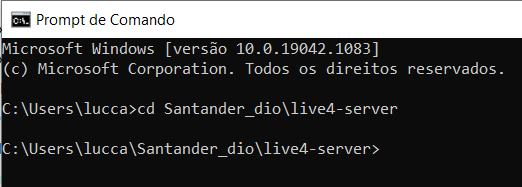
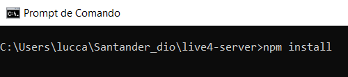
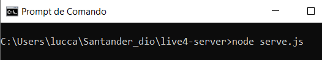
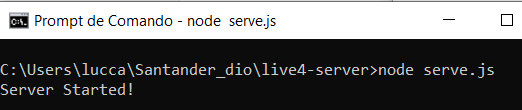

# Projeto DIO Live4 Server :gear:

**INÍCIO**

Este repositório contém dados essenciais para a visualização do projeto live4 da DIO (https://github.com/Amorim-cyber/Projeto-Dio-Live4) 

**PRÉ-REQUISITO**

* node.js em seu computador

**INSTRUÇÕES**

1. Baixe os arquivos e coloque-os em um diretório de sua escolha

2. Abra o terminal e entre utilizando o comando `cd + <<caminho do diretório>>` 

</img>

3. As dependências do node já vem instaladas neste repositório contudo recomendo utilizar o comando `npm install` pelo menos uma vez para atualização. 

   </img>

4. Execute o comando `node serve.js` para iniciar o serviço

</img>

**PRONTO!!**

Server pronto para uso.

</img>

### Forte abraço! :smile:

